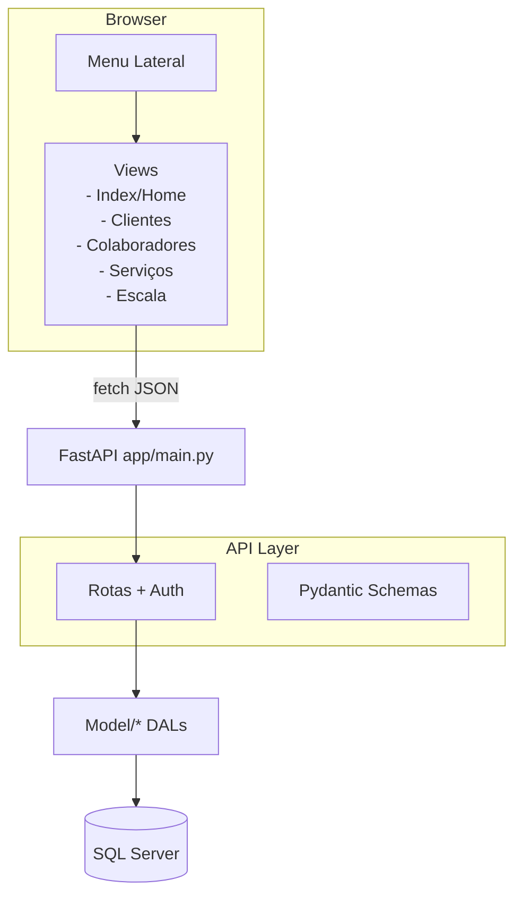
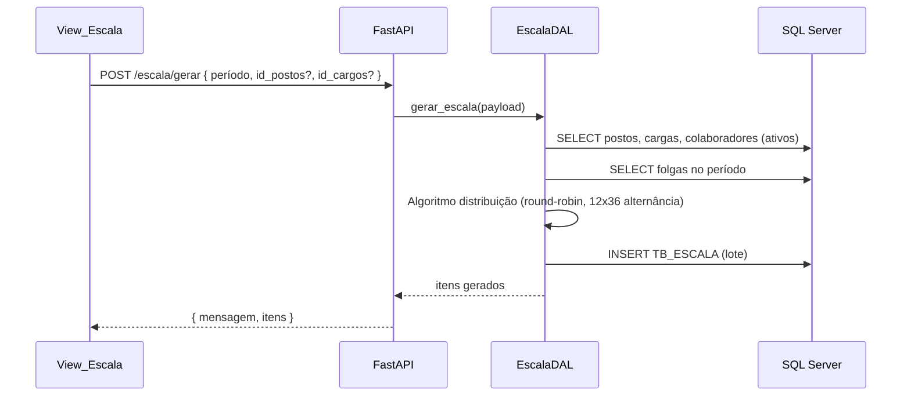
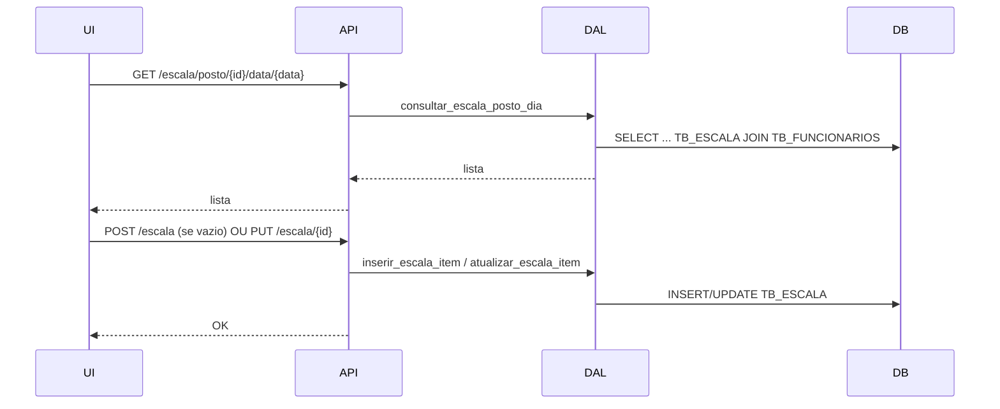

# Arquitetura e Fluxos

## Visão Geral

- Front-end (HTML/CSS/JS) em `app/Views/` e `app/Views_Escala/`
- Back-end FastAPI em `app/main.py`
- Acesso a dados via DALs em `app/Model/` (pyodbc + SQL Server)
- Esquemas de validação em `app/Schemas/`

## Diagrama (Mermaid)

## Fluxo de Escala (Geração)

## Fluxo de Edição por Célula

